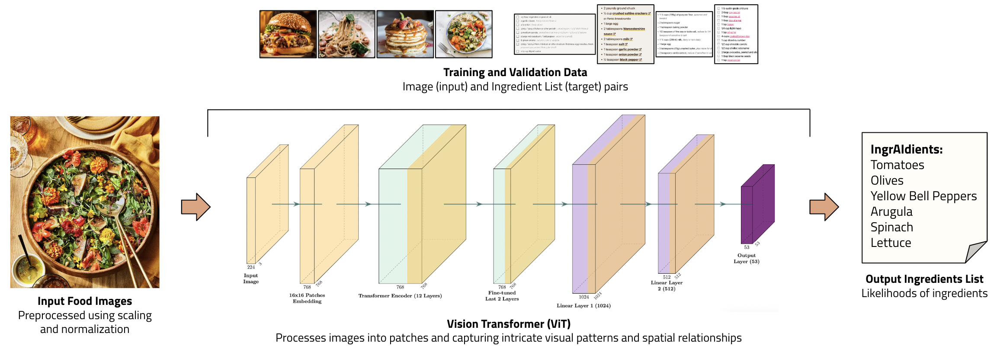
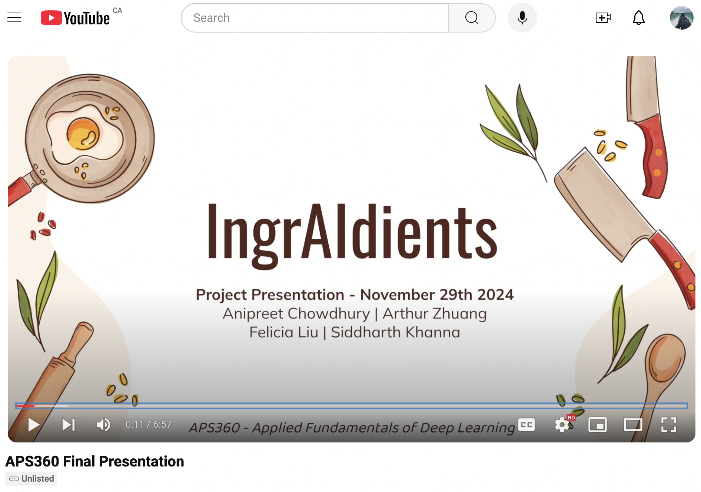

# IngrAIdients

This project is motivated by the growing trend toward health-conscious living, where the ability to quickly identify ingredients in food can enhance meal preparation, dietary tracking, and nutrition management. As more individuals aim to improve their well-being, there is a demand for tools that facilitate nutrition insights. Our objective is to develop a deep learning algorithm that can accurately detect a short list of ingredients (output) from a single image of a prepared dish (input). 

Deep learning models, particularly Vision Transformers (ViTs), are ideal for ingredient identification from food images due to their ability to capture global context by processing images as sequences of patches. This enables ViTs to learn complex patterns, differentiate similar ingredients, and scale effectively with large, diverse datasets, ensuring accurate and reliable ingredient detection, addressing our application's requirements.

## Course Details

**APS360:** 
Applied Fundamentals of Deep Learning Course Project.

**Students:**
Anipreet Chowdhury | Arthur Zhuang | Felicia Liu | Siddharth Khanna

**Deliverables Timeline:**
- Team Formation (Sep 17, 2024) - COMPLETED
- Project Proposal (Oct 4, 2024) - COMPLETED
- Progress Report (Nov 1, 2024) - COMPLETED
- Final Deliverable (Nov 29, 2024) - COMPLETED
- Project Presentation (Nov 29, 2024) - COMPLETED

## Repo Details

**DataProcessing**: 
>Scripts for cleaning, standardizing, and organizing the dataset, including mapping ingredients to coherent categories and handling imbalanced data. Also includes metadata analysis and visualization.

**BaselineModel**: 
>Contains the implementation of baseline model used for comparison with our deep learning model. Includes training scripts, configurations, and performance evaluations.

**DeepModel**: 
>Includes the Vision Transformer (ViT) implementation, model training and evaluation scripts, hyperparameter tuning, and saved model checkpoints.

**Webscraping**: 
>Includes scripts for collecting data from Pinch of Yum sites, ensuring data relevance and diversity for training.

**UserInterface**: 
>Scripts and prototypes for the user-facing system or demo, showcasing how the model outputs ingredient predictions from uploaded images through our mock app.

**Images**: 
>Contains some project-related images, including example input-output visualizations, model architecture diagrams, and other illustrations used in deliverables and presentations.

**WrittenDeliverables**: 
>Stores project documentation, including the proposal, progress report, final report, presentation slides, and formatted references.

## Course Deliverables

- **Project Proposal:** [Click Here!](WrittenDeliverables/APS360_Project_Proposal.pdf)
- **Progress Report:** [Click Here!](WrittenDeliverables/APS360_Progress_Report.pdf)
- **Final Report:** [Click Here!](WrittenDeliverables/APS360_Final_Report__FINAL_.pdf)
- **Final Presentation:** [Watch the Video!](https://www.youtube.com/watch?v=_ovCZOwkOvM)

